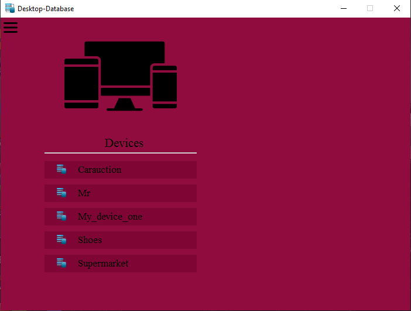
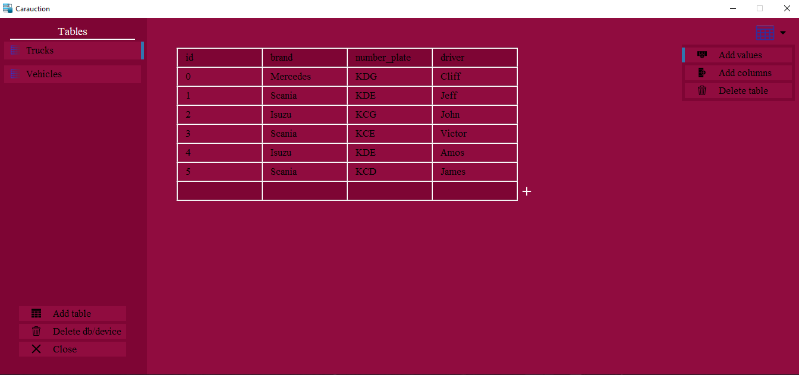
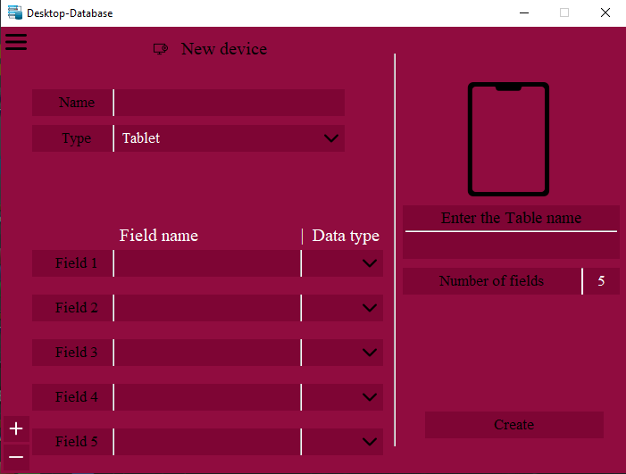
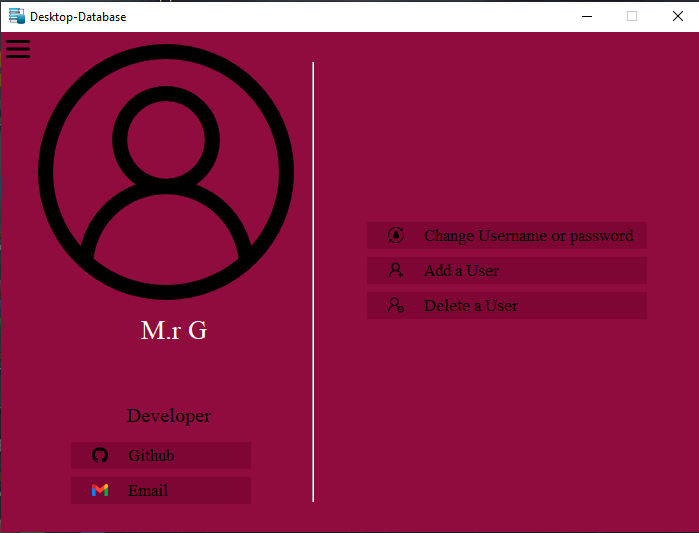

# Mysql-database-using-python-and-tkinter

Through this project the use of database has been made simpler
From queries to pressing of buttons and use of a rich gui.

## Home page

The Home page displays all the databases created by the program and pressing any of the buttons opens the database.

## Database page

The database then shows the tables present and the data inside the table.Through this page you can add a column or insert data into the table.

## Add device/database page

The Add device page/database enables you to create a database based on the device associated with the database(Smartphone,Tablet or Laptop). It allows a maximum of five fields/column for the table which can be added in the database page.

## Settings page

The Settings page enables you to change the password, add a user or delete a user. You can also reach the developer through the GitHub button which opens this GitHub account or through the Gmail button which copies the developer's email address to clipboard.

Contact: Gikuhiezekiel@gmail.com
